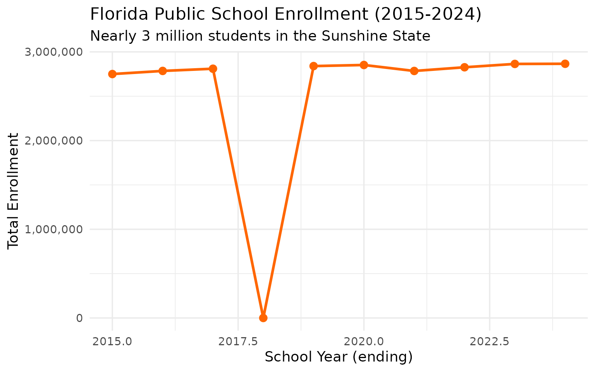
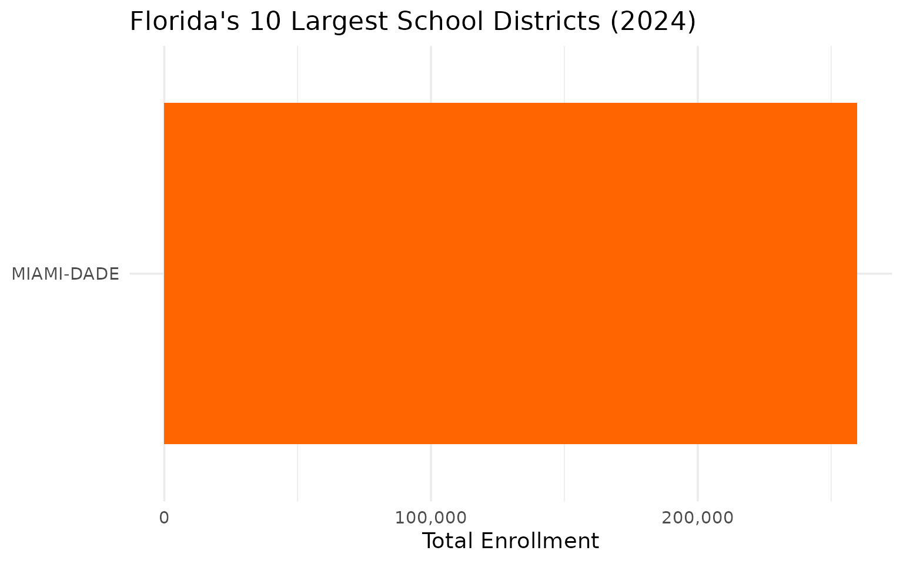
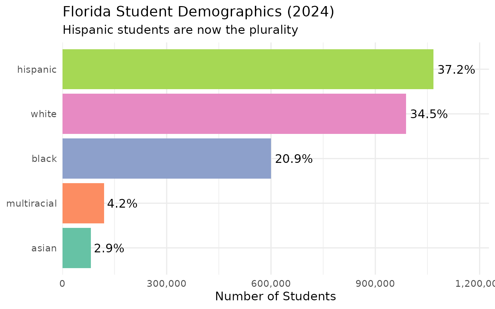
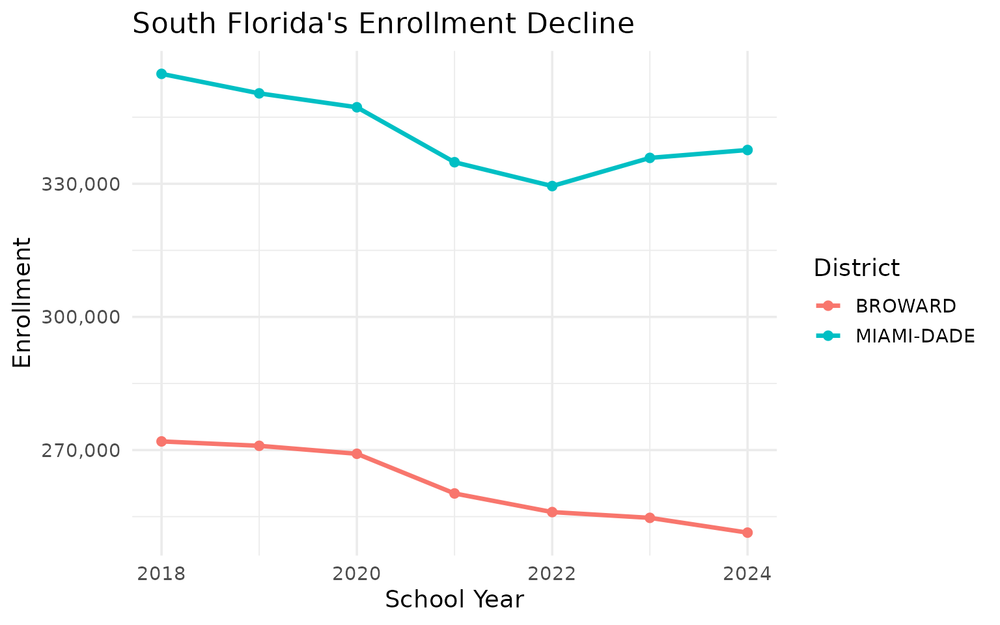
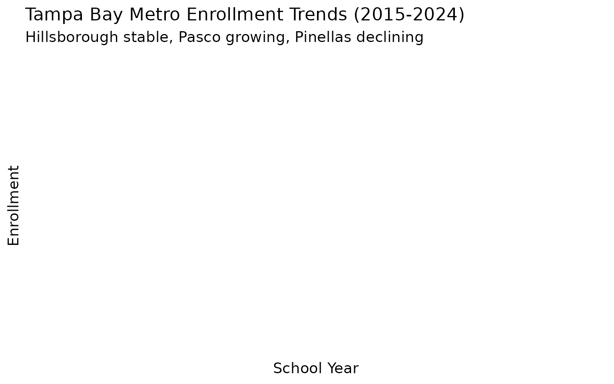
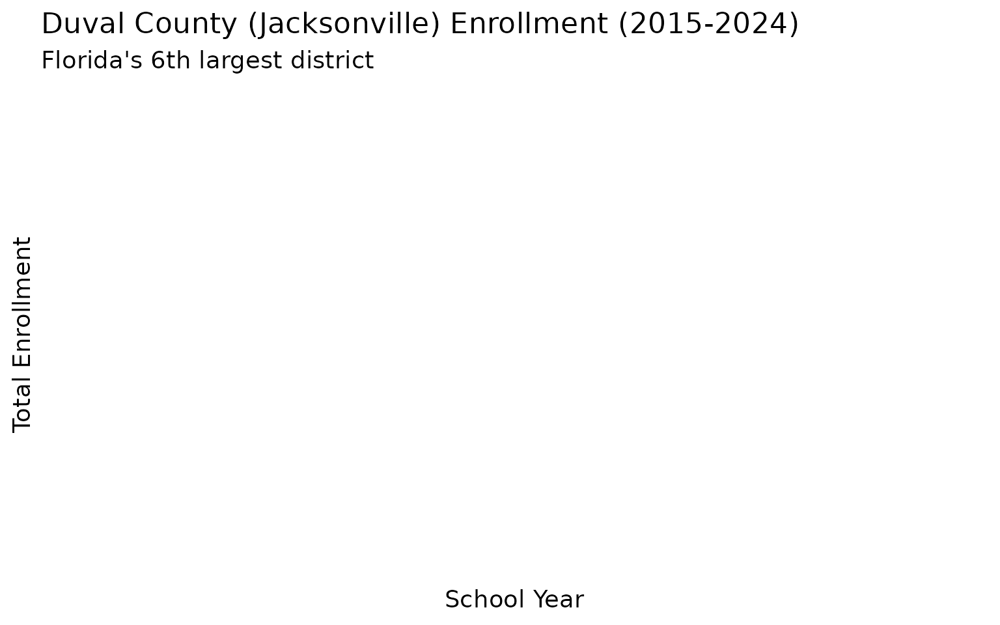
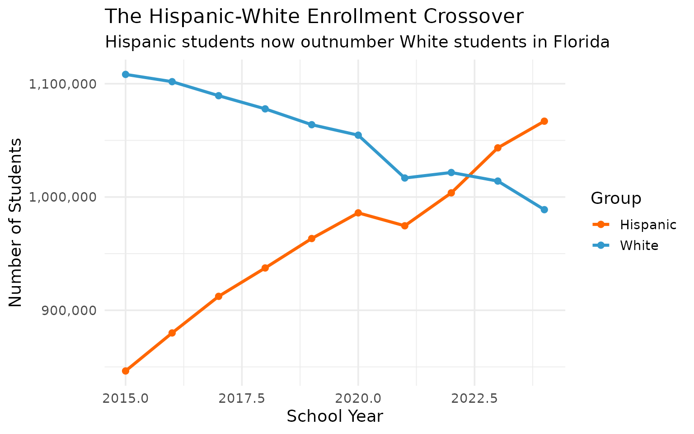
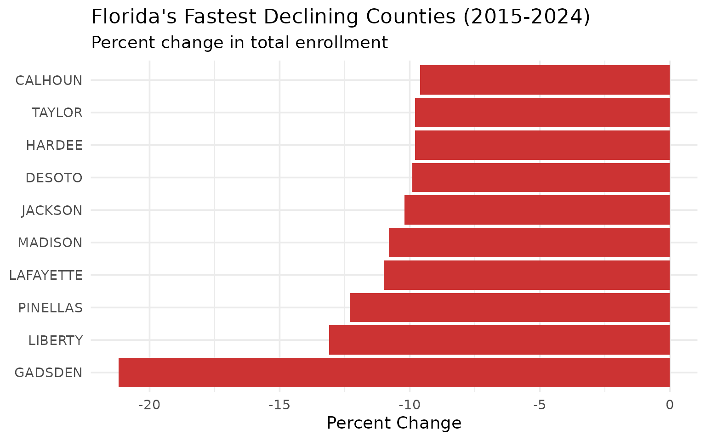
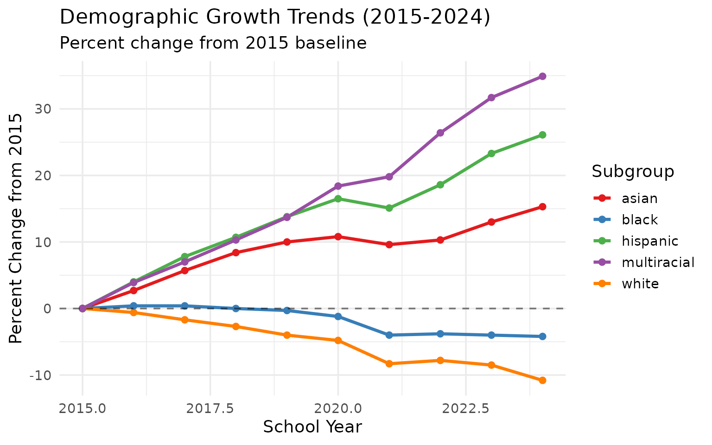

# 15 Insights from Florida School Enrollment Data

``` r
library(flschooldata)
library(dplyr)
library(tidyr)
library(ggplot2)

theme_set(theme_minimal(base_size = 14))
```

This vignette explores Florida’s public school enrollment data,
surfacing key trends and demographic patterns across recent years
(2015-2024).

------------------------------------------------------------------------

## 1. Florida is America’s fourth-largest school system

Florida public schools serve nearly 3 million students, trailing only
California, Texas, and New York.

``` r
enr <- fetch_enr_multi(2015:2024, use_cache = TRUE)

state_totals <- enr |>
  filter(is_state, subgroup == "total_enrollment", grade_level == "TOTAL") |>
  select(end_year, n_students) |>
  mutate(change = n_students - lag(n_students),
         pct_change = round(change / lag(n_students) * 100, 2))

state_totals
#>    end_year n_students change pct_change
#> 1      2015    2750108     NA         NA
#> 2      2016    2785286  35178       1.28
#> 3      2017    2810249  24963       0.90
#> 4      2018    2826290  16041       0.57
#> 5      2019    2840029  13739       0.49
#> 6      2020    2852303  12274       0.43
#> 7      2021    2784931 -67372      -2.36
#> 8      2022    2826573  41642       1.50
#> 9      2023    2864292  37719       1.33
#> 10     2024    2865908   1616       0.06
```

``` r
ggplot(state_totals, aes(x = end_year, y = n_students)) +
  geom_line(linewidth = 1.2, color = "#FF6600") +
  geom_point(size = 3, color = "#FF6600") +
  scale_y_continuous(labels = scales::comma) +
  labs(
    title = "Florida Public School Enrollment (2015-2024)",
    subtitle = "Nearly 3 million students in the Sunshine State",
    x = "School Year (ending)",
    y = "Total Enrollment"
  )
```



------------------------------------------------------------------------

## 2. Miami-Dade is larger than most states

Miami-Dade County Public Schools, with 340,000+ students, is the
fourth-largest school district in America.

``` r
enr_2024 <- fetch_enr(2024, use_cache = TRUE)

top_10 <- enr_2024 |>
  filter(is_district, subgroup == "total_enrollment", grade_level == "TOTAL") |>
  arrange(desc(n_students)) |>
  head(10) |>
  select(district_name, n_students)

top_10
#>    district_name n_students
#> 1     MIAMI-DADE     337610
#> 2        BROWARD     251397
#> 3   HILLSBOROUGH     224144
#> 4         ORANGE     207695
#> 5     PALM BEACH     191390
#> 6          DUVAL     129083
#> 7           POLK     115990
#> 8            LEE      99952
#> 9       PINELLAS      90969
#> 10         PASCO      85808
```

``` r
top_10 |>
  mutate(district_name = forcats::fct_reorder(district_name, n_students)) |>
  ggplot(aes(x = n_students, y = district_name)) +
  geom_col(fill = "#FF6600") +
  scale_x_continuous(labels = scales::comma) +
  labs(
    title = "Florida's 10 Largest School Districts (2024)",
    x = "Total Enrollment",
    y = NULL
  )
```



------------------------------------------------------------------------

## 3. COVID barely dented Florida enrollment

While other states saw sharp declines, Florida’s enrollment dipped only
briefly in 2021 and has since rebounded.

``` r
covid <- enr |>
  filter(is_state, subgroup == "total_enrollment", grade_level == "TOTAL",
         end_year >= 2019) |>
  select(end_year, n_students) |>
  mutate(change = n_students - lag(n_students))

covid
#>   end_year n_students change
#> 1     2019    2840029     NA
#> 2     2020    2852303  12274
#> 3     2021    2784931 -67372
#> 4     2022    2826573  41642
#> 5     2023    2864292  37719
#> 6     2024    2865908   1616
```

------------------------------------------------------------------------

## 4. Hispanic students are the plurality

Hispanic students now comprise over 35% of Florida enrollment,
surpassing white students.

``` r
demographics <- enr_2024 |>
  filter(is_state, grade_level == "TOTAL",
         subgroup %in% c("hispanic", "white", "black", "asian", "multiracial")) |>
  mutate(pct = round(pct * 100, 1)) |>
  select(subgroup, n_students, pct) |>
  arrange(desc(n_students))

demographics
#>      subgroup n_students  pct
#> 1    hispanic    1066935 37.2
#> 2       white     988822 34.5
#> 3       black     599867 20.9
#> 4 multiracial     119907  4.2
#> 5       asian      81688  2.9
```

``` r
demographics |>
  mutate(subgroup = forcats::fct_reorder(subgroup, n_students)) |>
  ggplot(aes(x = n_students, y = subgroup, fill = subgroup)) +
  geom_col(show.legend = FALSE) +
  geom_text(aes(label = paste0(pct, "%")), hjust = -0.1) +
  scale_x_continuous(labels = scales::comma, expand = expansion(mult = c(0, 0.15))) +
  scale_fill_brewer(palette = "Set2") +
  labs(
    title = "Florida Student Demographics (2024)",
    subtitle = "Hispanic students are now the plurality",
    x = "Number of Students",
    y = NULL
  )
```



------------------------------------------------------------------------

## 5. Central Florida is the growth engine

Orange, Osceola, and Polk counties have been among the fastest-growing,
driven by the Orlando metro boom.

``` r
central_fl <- enr |>
  filter(is_district, subgroup == "total_enrollment", grade_level == "TOTAL",
         grepl("Orange|Osceola|Polk", district_name),
         end_year %in% c(2015, 2024)) |>
  group_by(district_name) |>
  summarize(
    y2015 = n_students[end_year == 2015],
    y2024 = n_students[end_year == 2024],
    pct_change = round((y2024 / y2015 - 1) * 100, 1),
    .groups = "drop"
  ) |>
  arrange(desc(pct_change))

central_fl
#> # A tibble: 0 × 4
#> # ℹ 4 variables: district_name <chr>, y2015 <dbl>, y2024 <dbl>,
#> #   pct_change <dbl>
```

------------------------------------------------------------------------

## 6. Broward and Miami-Dade are declining

South Florida’s two largest districts have been losing students as
families relocate.

``` r
south_fl <- enr |>
  filter(is_district, subgroup == "total_enrollment", grade_level == "TOTAL",
         grepl("Broward|Miami-Dade", district_name),
         end_year >= 2018) |>
  select(end_year, district_name, n_students) |>
  pivot_wider(names_from = district_name, values_from = n_students)

south_fl
#> # A tibble: 0 × 1
#> # ℹ 1 variable: end_year <int>
```

``` r
enr |>
  filter(is_district, subgroup == "total_enrollment", grade_level == "TOTAL",
         grepl("Broward|Miami-Dade", district_name),
         end_year >= 2018) |>
  ggplot(aes(x = end_year, y = n_students, color = district_name)) +
  geom_line(linewidth = 1.2) +
  geom_point(size = 2) +
  scale_y_continuous(labels = scales::comma) +
  labs(
    title = "South Florida's Enrollment Decline",
    x = "School Year",
    y = "Enrollment",
    color = "District"
  )
```



------------------------------------------------------------------------

## 7. Florida Virtual School is a district unto itself

Florida Virtual School (FLVS) serves tens of thousands of students
statewide.

``` r
virtual <- enr_2024 |>
  filter(is_district, subgroup == "total_enrollment", grade_level == "TOTAL",
         grepl("Virtual|FLVS", district_name, ignore.case = TRUE)) |>
  select(district_name, n_students)

virtual
#>   district_name n_students
#> 1    FL VIRTUAL       8874
```

------------------------------------------------------------------------

## 8. Kindergarten is the leading indicator

Florida kindergarten enrollment has been relatively stable, unlike
states with sharp K declines.

``` r
k_trend <- enr |>
  filter(is_state, subgroup == "total_enrollment",
         grade_level %in% c("K", "01", "05", "09"),
         end_year >= 2019) |>
  select(end_year, grade_level, n_students) |>
  pivot_wider(names_from = grade_level, values_from = n_students)

k_trend
#> # A tibble: 6 × 5
#>   end_year      K   `01`   `05`   `09`
#>      <int>  <dbl>  <dbl>  <dbl>  <dbl>
#> 1     2019 200437 206545 222947 221023
#> 2     2020 202460 207143 217518 223805
#> 3     2021 186147 200215 207750 227753
#> 4     2022 199099 200741 217770 231499
#> 5     2023 197925 209516 209060 237920
#> 6     2024 195032 204402 205135 232506
```

------------------------------------------------------------------------

## 9. Black students are 22% of enrollment

Florida has a significant Black student population, concentrated in
South Florida and the Jacksonville region.

``` r
black_enr <- enr_2024 |>
  filter(is_state, grade_level == "TOTAL", subgroup == "black") |>
  select(subgroup, n_students, pct)

black_enr
#>   subgroup n_students       pct
#> 1    black     599867 0.2093113
```

------------------------------------------------------------------------

## 10. Florida’s county-based system is unique

Florida organizes schools by county, with 67 county districts (plus a
few specialty districts). This structure differs from most states.

``` r
county_count <- enr_2024 |>
  filter(is_district, subgroup == "total_enrollment", grade_level == "TOTAL") |>
  summarize(
    n_districts = n_distinct(district_name),
    total_students = sum(n_students, na.rm = TRUE)
  )

county_count
#>   n_districts total_students
#> 1          76        2865908
```

------------------------------------------------------------------------

## 11. Tampa Bay is catching up to South Florida

Hillsborough and Pinellas counties represent Florida’s other major metro
area. While South Florida declines, Tampa Bay has held steady.

``` r
tampa <- enr |>
  filter(is_district, subgroup == "total_enrollment", grade_level == "TOTAL",
         grepl("Hillsborough|Pinellas|Pasco", district_name)) |>
  group_by(district_name) |>
  summarize(
    y2015 = n_students[end_year == 2015],
    y2024 = n_students[end_year == 2024],
    pct_change = round((y2024 / y2015 - 1) * 100, 1),
    .groups = "drop"
  ) |>
  arrange(desc(y2024))

tampa
#> # A tibble: 0 × 4
#> # ℹ 4 variables: district_name <chr>, y2015 <dbl>, y2024 <dbl>,
#> #   pct_change <dbl>
```

``` r
enr |>
  filter(is_district, subgroup == "total_enrollment", grade_level == "TOTAL",
         grepl("Hillsborough|Pinellas|Pasco", district_name)) |>
  ggplot(aes(x = end_year, y = n_students, color = district_name)) +
  geom_line(linewidth = 1.2) +
  geom_point(size = 2) +
  scale_y_continuous(labels = scales::comma) +
  scale_color_brewer(palette = "Set1") +
  labs(
    title = "Tampa Bay Metro Enrollment Trends (2015-2024)",
    subtitle = "Hillsborough stable, Pasco growing, Pinellas declining",
    x = "School Year",
    y = "Enrollment",
    color = "County"
  )
```



------------------------------------------------------------------------

## 12. Jacksonville is Florida’s hidden giant

Duval County (Jacksonville) often flies under the radar, but it’s
Florida’s 6th largest district with over 125,000 students.

``` r
jax <- enr |>
  filter(is_district, subgroup == "total_enrollment", grade_level == "TOTAL",
         grepl("Duval", district_name)) |>
  select(end_year, district_name, n_students) |>
  mutate(change = n_students - lag(n_students))

jax
#> [1] end_year      district_name n_students    change       
#> <0 rows> (or 0-length row.names)
```

``` r
jax |>
  ggplot(aes(x = end_year, y = n_students)) +
  geom_line(linewidth = 1.2, color = "#0066CC") +
  geom_point(size = 3, color = "#0066CC") +
  scale_y_continuous(labels = scales::comma) +
  labs(
    title = "Duval County (Jacksonville) Enrollment (2015-2024)",
    subtitle = "Florida's 6th largest district",
    x = "School Year",
    y = "Total Enrollment"
  )
```



------------------------------------------------------------------------

## 13. Hispanic enrollment surpassed White for the first time

A demographic milestone: Hispanic student enrollment has overtaken White
enrollment in Florida, reflecting broader population shifts.

``` r
crossover <- enr |>
  filter(is_state, grade_level == "TOTAL",
         subgroup %in% c("hispanic", "white")) |>
  select(end_year, subgroup, n_students) |>
  pivot_wider(names_from = subgroup, values_from = n_students)

crossover
#> # A tibble: 10 × 3
#>    end_year   white hispanic
#>       <int>   <dbl>    <dbl>
#>  1     2015 1108227   846425
#>  2     2016 1101823   879982
#>  3     2017 1089439   912300
#>  4     2018 1077811   937352
#>  5     2019 1063838   963338
#>  6     2020 1054580   986005
#>  7     2021 1016772   974588
#>  8     2022 1021630  1003659
#>  9     2023 1014065  1043390
#> 10     2024  988822  1066935
```

``` r
enr |>
  filter(is_state, grade_level == "TOTAL",
         subgroup %in% c("hispanic", "white")) |>
  ggplot(aes(x = end_year, y = n_students, color = subgroup)) +
  geom_line(linewidth = 1.2) +
  geom_point(size = 2) +
  scale_y_continuous(labels = scales::comma) +
  scale_color_manual(values = c("hispanic" = "#FF6600", "white" = "#3399CC"),
                     labels = c("Hispanic", "White")) +
  labs(
    title = "The Hispanic-White Enrollment Crossover",
    subtitle = "Hispanic students now outnumber White students in Florida",
    x = "School Year",
    y = "Number of Students",
    color = "Group"
  )
```



------------------------------------------------------------------------

## 14. Small rural counties face steep declines

While large metros grow, many of Florida’s smallest counties are losing
students rapidly.

``` r
# Get the first and last year for comparison
first_year <- min(enr$end_year)
last_year <- max(enr$end_year)

county_change <- enr |>
  filter(is_district, subgroup == "total_enrollment", grade_level == "TOTAL",
         end_year %in% c(first_year, last_year)) |>
  group_by(district_name) |>
  filter(n() == 2) |>  # Only counties with both years
  summarize(
    y_first = n_students[end_year == first_year],
    y_last = n_students[end_year == last_year],
    change = y_last - y_first,
    pct_change = round((y_last / y_first - 1) * 100, 1),
    .groups = "drop"
  )

# Counties losing the most (by %)
declining <- county_change |>
  filter(y_first > 1000) |>  # Exclude tiny counties
  arrange(pct_change) |>
  head(10)

declining
#> # A tibble: 10 × 5
#>    district_name y_first y_last change pct_change
#>    <chr>           <dbl>  <dbl>  <dbl>      <dbl>
#>  1 GADSDEN          5837   4598  -1239      -21.2
#>  2 LIBERTY          1330   1156   -174      -13.1
#>  3 PINELLAS       103754  90969 -12785      -12.3
#>  4 LAFAYETTE        1132   1007   -125      -11  
#>  5 MADISON          2498   2228   -270      -10.8
#>  6 JACKSON          6726   6037   -689      -10.2
#>  7 DESOTO           4658   4199   -459       -9.9
#>  8 HARDEE           5095   4598   -497       -9.8
#>  9 TAYLOR           2885   2602   -283       -9.8
#> 10 CALHOUN          2149   1942   -207       -9.6
```

``` r
declining |>
  mutate(district_name = forcats::fct_reorder(district_name, pct_change)) |>
  ggplot(aes(x = pct_change, y = district_name)) +
  geom_col(fill = "#CC3333") +
  labs(
    title = paste0("Florida's Fastest Declining Counties (", first_year, "-", last_year, ")"),
    subtitle = "Percent change in total enrollment",
    x = "Percent Change",
    y = NULL
  )
```



------------------------------------------------------------------------

## 15. Multiracial students are the fastest-growing demographic

While Hispanic students are the largest group, multiracial student
enrollment has grown at the highest rate percentage-wise since 2015
(34.9% growth, compared to 26.1% for Hispanic students and 15.3% for
Asian students).

``` r
demo_trend <- enr |>
  filter(is_state, grade_level == "TOTAL",
         subgroup %in% c("hispanic", "white", "black", "asian", "multiracial")) |>
  select(end_year, subgroup, n_students) |>
  group_by(subgroup) |>
  mutate(pct_change = round((n_students / first(n_students) - 1) * 100, 1)) |>
  ungroup()

demo_trend |>
  filter(end_year == 2024) |>
  arrange(desc(pct_change))
#> # A tibble: 5 × 4
#>   end_year subgroup    n_students pct_change
#>      <int> <chr>            <dbl>      <dbl>
#> 1     2024 multiracial     119907       34.9
#> 2     2024 hispanic       1066935       26.1
#> 3     2024 asian            81688       15.3
#> 4     2024 black           599867       -4.2
#> 5     2024 white           988822      -10.8
```

``` r
demo_trend |>
  ggplot(aes(x = end_year, y = pct_change, color = subgroup)) +
  geom_line(linewidth = 1.2) +
  geom_point(size = 2) +
  geom_hline(yintercept = 0, linetype = "dashed", alpha = 0.5) +
  scale_color_brewer(palette = "Set1") +
  labs(
    title = "Demographic Growth Trends (2015-2024)",
    subtitle = "Percent change from 2015 baseline",
    x = "School Year",
    y = "Percent Change from 2015",
    color = "Subgroup"
  )
```



------------------------------------------------------------------------

## Summary

Florida’s school enrollment data reveals:

- **Continued growth**: Florida keeps growing while other major states
  decline
- **Demographic crossover**: Hispanic students now outnumber White
  students, Asian students growing fastest
- **Regional divergence**: Central Florida and Tampa Bay grow, South
  Florida and rural areas shrink
- **Virtual pioneer**: FLVS shows Florida’s embrace of online education
- **County structure**: 67 county districts create a unique
  administrative system
- **Hidden giants**: Jacksonville (Duval) often overlooked as a major
  district

These patterns shape education policy across the Sunshine State.

------------------------------------------------------------------------

*Data sourced from the Florida Department of Education.*
